### CAN (Controller Area Network)

##### Content

What you get cover and understand after these chapter

- ..
- ..

#### Why we need CAN Controller?

increasing #of ECUs(complexity of ECUs communication)

Conventional Network

- Note: I2C used for small distances because has no error checking mechanism, has very sensitive for noise
  

#### CAN History

- Bosch(Tier 1 Supplier) is a German Company
- at `1985` starts development for 10 years
- in 1991 CAN produced
- 2004 CAN standarized

#### CAN Hardware Interface


##### Design Choices of HW interfaces

- protocol should be simple connection
- allow many of nodes
- Noise immunity

###### Easy Plug and Play(only 2 wires)

###### Noise immunity

- Differential Communication (causes External (bus signal) noise cancelation)
  - Effective signal = CANH - CANL
- Twisted Pair (prevent cross talk internal noise cancelation)
  المجال المغناطيسي الناشئ في كل سلكه عكس المجال الناشئ من السلكه التانيه فيبغلوا بعض
  
- Terminator Resistor (120 ohm)
  - Transient Phonemema cancalation
  - This phonemema due to high rate, high voltage
    

#### CAN Characteristics

`1)` Asynchronous
`2)` Half Duplex
`3)` Max #of nodes: 32(recommended), Max Distance 40 Meter
`4)` Two Versions high speed(1M bps), low speed (125k bps)
`5)` Master/slave
`6)` Multi Master No Slave `MMNS`
`7)` Throughput (Min: 0%, Max: ??)
`8)` Differential Communication

| Characteristics    | CAN protocol |
| :----------------- | :----------: |
| Synchronization    | Asnychronous |
| data               | Half Duplex  |
| N/N relation       |     MMNS     |
| Network connection |     bus      |
| N/N relation       |     MMNS     |

- `note`: LIN is also MMNS , but simplified version from CAN, SW protocol
- `Observation`: you can implement any communication protocol by sw with DIO, Timer, ADC peripherals
  - like LIN, ICU, even CAN

#### CAN node


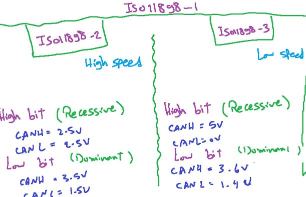

- These values according to length, speed, power,etc.

`Note:` What if network nodes has different CAN types? - The network engineer adjust its logic range

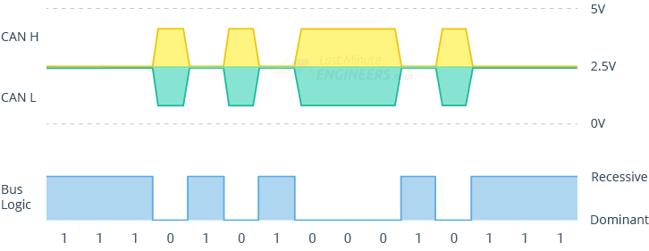

#### CAN protocol principles

- Message Oriented protocol
- Every Message has ID, and only one owner
- Host (MC) says what to CAN Controller?

  - MSG ID
  - Data
  - and CAN Controller do rest of the job
    
    

- `Qeustion:` Is it allow to communicate between 2 MC without CAN transceivers?
  - yes, with smaller distance. because transciver used to amplify signals

#### CAN Frame


- SOF: Start of Frame
- RTR: Remote Transmission Frame Request
  - 0: Data Frame (Write) (owner only)
  - 1: Remote Frame (Read Request)
- IDE: ID Extension(11 bit)
  - 1: Extension (add 18 bit extension MSG ID)
  - 0: No Extension
- DLC: Data Length
  - 0000: 0 Byte (Remote Frame)
  - 1000: 8 Byte(even of 1111)
- CRC: Cyclic Redundancey Check (15 Bit)
- DEL: Delimeter (بيقوله اهدي شويه نرتاح)
- ACK: Acknowledge
  - 0: ACK
  - 1: Not ACK
- EOF: End of Frame (7 recessive bits)
- ITS: Inter Frame Space (3 bits)(فاصل بين الframes)

- note: Any `node` can send `message ID` to request data, But only `owner` can send `message Data`

#### Frame size till now (without bit stuffing,..)


- `Question:` Is this very slow?
  - No, CAN is message Oriented so it can speaks with more than node in the same Time

---

### Communication protocol Concepts or problems

#### Starvation مجاعه لباقي النودز

```
بمعني ان نود بقيت ماستر وماسكه البص وعماله تتكلم  مش عايزه تسكت فحصل مجاعه لباقي النودز
```

- No starvation in CAN protocol, exists in I2C protocol
  - solved by ITS, and data has max length
  - so if higher priority node wants to speak can speak after frame ends

#### Arbitration خناقه

Happened when 2 nodes speaks in the same time

- you have to know the dominent and recessive bit Concept firstly
  
  

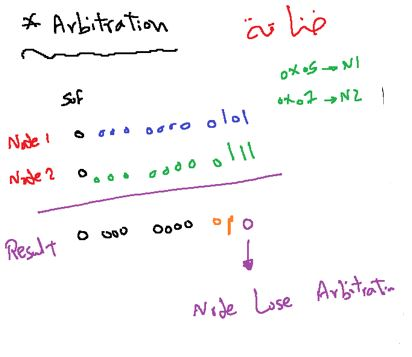

- these handled by CAN Controllers, each controller send then read bus state to detect if there is arbitration or not

#### Questions (T/F)


- Q2. Because the 0 is the dominent bit
- Q3. if the RTR is 1 also(Read) so these is no loser because there is no data, and nodes read

---

#### Bit Stuffing

- CAN apply Rule that states on;
  - only 5 identical bits must be followed by `stuff bit` in the opposite level, and receiver should ignore it(just to recongise that sender is working well)
    - 00000`1`, 11111`0`

usage: to handle case like, CAN Protocol is Asynchronous(No clock), what if node علقت failed


- bit stuffing can happened all the time
  

  - max size: ..............

- `Question:` What is the CAN DB?
  - indentifying or configure the host as sender or receiver to each Message ID, CANDB is required from Customer

#### Error Detection & Control

CAN can detect the errors and also control it (amazing)

##### Error types

4 errors, 3 by receiver and 1 by sender

- Frame check(Receiver)
  - for example: RTR: 1(Read), and DLC: not equal 0
- stuff check (Receiver)
- CRC check (Receiver)
- Ack check (Sender)

##### Error Reporting

- Active Error Frame(6 dominent bits, 6 recessive bits)
- Passive error frame Error Frame (6 recessive bits) (neglected)
  

###### What if node (transmitter or receiver) fails(علقت) and sends an active error frame at some time

so to handle these cases CAN provide judgement concept
that punish the transmitter and receiver when error error sends with (TEC, REC) values(value is configurable)

- TEC: Transmission Error Counter
- REC: Receiver Error Counter

- Depending on TEC and REC values to Transmiiter and Receiver we judge(حكم) and enter each node in state(Active , Passive , Bus Off)
- in passive state:

  - node can send and receiver
  - can't stop a frame
  - so we now don't worry from this node
  - we will give it an opportinity to be come better again
  - if still fails (TEC > 255) enter bus off state(now can't send or receive)

- CAN is fair also

  - if node sends and receive correctly, CAN give them a price(يكافئهم)

- when node fails
  - CAN TEC or REC value increase by 8(configurable)

```
الكان بيعتبر الغلطه ب 8 و الجايزه ب 1
```


#### Overload frame

```
inituation:
اونر عايز يقول للنودز اهدوا انا مش بايظ بس مش ملاحق عليكوا
```

- 6 dominent bits

  - like active error frame with no TEC, REC change
    

- `Question:` How Nodes differentiate between overload and active error frames?

  - from sending timing, overlaod can send only in ITS time
    
    - overlaod frame sends instead of ITS bits

- `Question:` what about stuffing in these Frame 6 bits
  - No stuffing, stuffing only in Data Frame

#### Summary of CAN Frame types

`1)` DATA Frame
`2)` Remote Frame
`3)` Active Error Frame
`4)` Passive Error Frame
`5)` Overload Frame

---

## CAN_FD

- CAN Flexiable Data rate

  - `same frame time with up to 64 Byte`

- `Note`: Vehicle contains more than CAN Network

###### inituation why we need CAN_FD, or classical CAN Constraints

```
عايز ابعت داتا اكتر بنفس وقت الفريم القديم
```

`1)` Limited Data Size "8 Bytes"
`2)` high bus load

- due to huge number of messages (cause more arbitrations)

##### Difference between classical CAN Frame and CAN_FD Frame?

`1)` RRS: instead of RTR

- RRS: Remote Request Substitute
- RRS always LOW

`2)` FDF: Flexiable Data rate format
to switch between classical CAN and CAN_FD

- FDF:
  special differnt(اختلاف جوهري) between them

  - 0: Classical CAN
  - 1: CAN_FD

- `observation`: if you send a classical frame and this bit become 1, error frame should send

`3)` BRS: Bit Rate Switch

- BRS:
  - 0: same data rate for control & data part
  - 1: data rate (5Mbps) control(1Mbps)

`4)` ESI: Error State Indicator

- 0: Active
- 1: Passive

```
Propagation delay
الوقت اللي بتاخدع الاشاره من الهوست للبص
وهو العائق اللي مانعنا من زياده السرعه عن 1ميجا
فعشان كده الجزء بتاع الداتا مفيهوش الديلاي دا او اقل يعني فبنزود فيه السرعه عادي
```

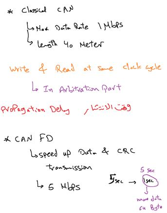

- `Question:` Why we don't have Remote Frame in CAN_FD?
  - because it doesn't contain Data, and that's why we create CAN_FD(increase data size), so it doesn't make sense

---

### CAN Driver Implementation

our nodes: ATmega32(HOST) with MCP2515 (Classical CAN Controller)
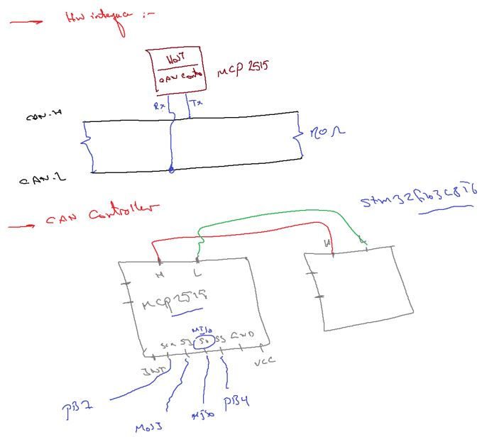
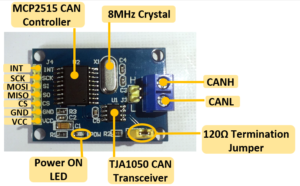
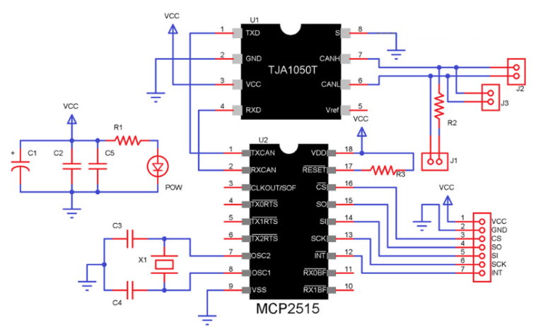

#### Bit Stuffing

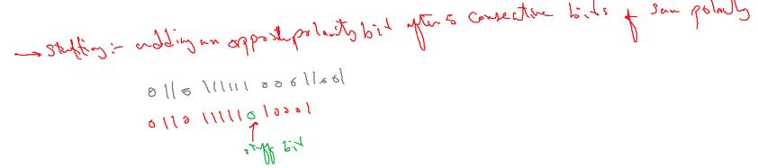

#### As we know CAN is Asynchronous Protocol, So how CAN handling communication timing ?

#### Bit Timming

- AKA `Bit rate` or `Nominal bit rate`.
- Bit timing is the count of time Quanta
- (tq,a basic unit of bit time) required to carry a single bit(i.e tour of a bit on CAN bus from writing to reading) on CAN Bus

- As per CAN standard CAN supports bit-rate up to 1Mbps.
  - it all depends on the CAN network length.
- bit rate can be configured individually for each CAN node connected on CAN network

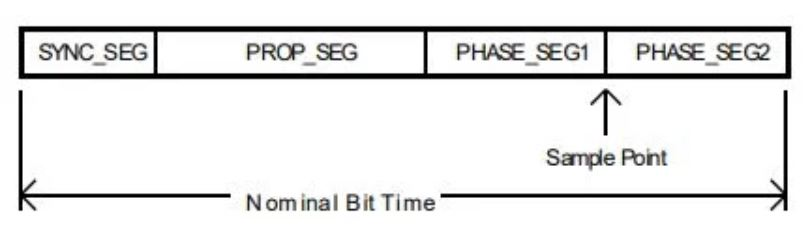

- a bit time is divided into 4 segments and each segment has some specific programmable number of time quanta(tq)

1. Synchronization Segment (Tsync_seg)
2. Propagation Segment (Tprop_seg)
3. Phase Segment 1(Tphase_seg1)
4. Phase Segment 2(Tphase_seg2)

- The `oscillator frequencies` of Nodes(`ECUs`) have some `instability` because of some `environmental factors` which can cause `synchronization error`
  - but every `Node` is configured itself to maintain `its bit synchronization` by `adjusting` `bit time` if the `frequency deviation` is within `its tolerance limit`.

| Segments    |   Value   |                        Description                        |
| :---------- | :-------: | :-------------------------------------------------------: |
| Tsync_seg   |   1 tq    |                           Fixed                           |
| Tprop_seg   | [1..8] tq |  Programmable.(Adjust according to physical delay time)   |
| Tphase_seg1 | [1..8] tq | Programmable.(Lengthened temporarily for synchronization) |
| Tphase_seg2 | [1..8] tq | Programmable.(Shortened temporarily for synchronization)  |

##### Time Quanta(Tq)

```c
tq = BRP / fsys
// BRP = Baud Rate Prescaler
// fsys = MCU system Clock(typically =Fosc)
```

#### synchronization segment

```
محتاجين الاشاره تقع فيها
```

- `observation:` CAN Bit timing like baud rate in UART

##### Bit Rate Calculation Examples

`Q`. Calculate Required Time Quanta to achieve 500kbps baud rate if the system clock is 40mhz and CAN clock divider is 4.

```c
CAN clock(fcan) = 40 / 4 = 10 MHz

time Quanta(tq) = 1 / fcan = 1 / 10 = 100ns

bit rate = 500kbps

bit time = 1 / 500kbps = 2us

no of tq = 2us / 100ns = 20tq.
```

`Q`. Configure TSEG1 and TSEG2 to set sampling at 80% of a bit time.

```c
(Tsync_seg+TSEG1) / (Tsync_seg + TSEG1 + TSEG2) = 80%

as we calculated above: bit time = Tsync_seg+TSEG1+TSEG2=20tq

so , (1 + TSEG1) / (20) = 80%

TSEG1 = 16 - 1 = 15

so TSEG2 = 20 - 1 - 15 = 4

so final values are :

Tsync_seg = 1(fixed)

TSEG1 = 15

TSEG2 = 4
```

##### Bit timing Registers

CNF1, CNF2, CNF3
SJW: Synchronization jump width (sample point shift by quanta)

##### SPI clock polarity / clock phase

is very important to make CAN IDLE edge(falling edge)

#### CAN modes of operations

differs from CAN controller to other.
in MCP2515

1. configuration mode
2. normal mode
3. sleep mode
4. listen-only mode
5. loopback mode

#### Actual Frame Format

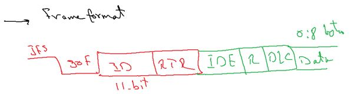

#### CAN Transmitter and Receiver APIs

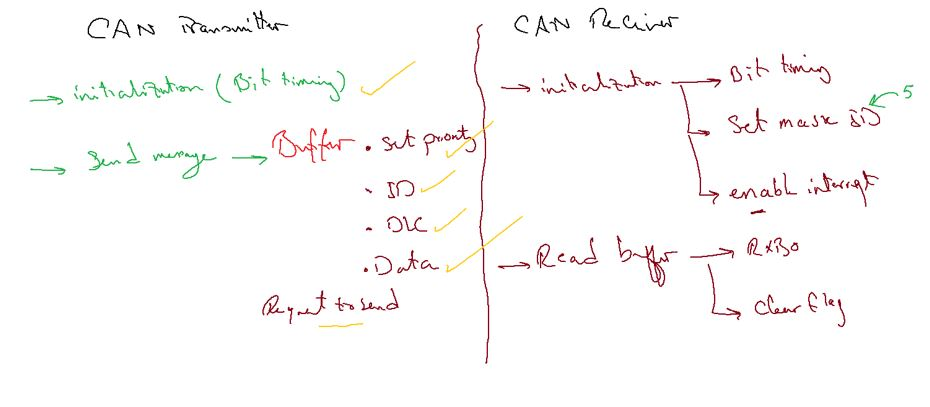

- **note**: priority in CAN protocol depends on message ID but in MCP2515 sets in buffer
- in CAN receiver: clear flag(INT pin)

from MCP2515 Datasheet: SPI Interface

#### Resources

[can-protocol-introduction](https://medium.com/@mohammednumeir13/can-protocol-introduction-9544eacddfd0)
[arduino-module-tutorial](https://lastminuteengineers.com/mcp2515-can-module-arduino-tutorial/)
[can-protocol-bit-timing-and-calculation ](https://embedclogic.com/can-protocol/can-protocol-bit-timing-and-calculation/)

[Arduino-MCP2515_Lib](https://github.com/107-systems/107-Arduino-MCP2515)
[arduino-CAN_lib](https://github.com/sandeepmistry/arduino-CAN)
